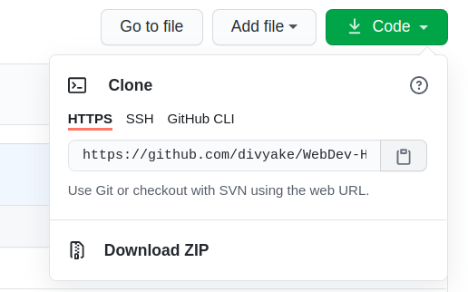
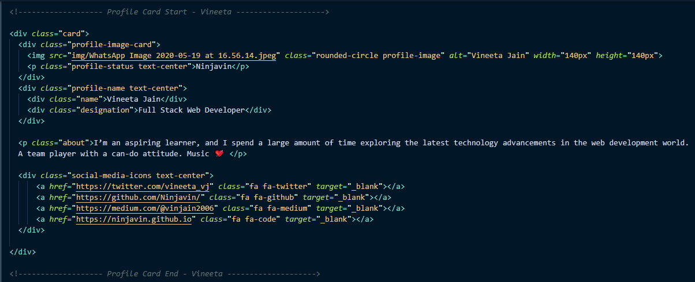
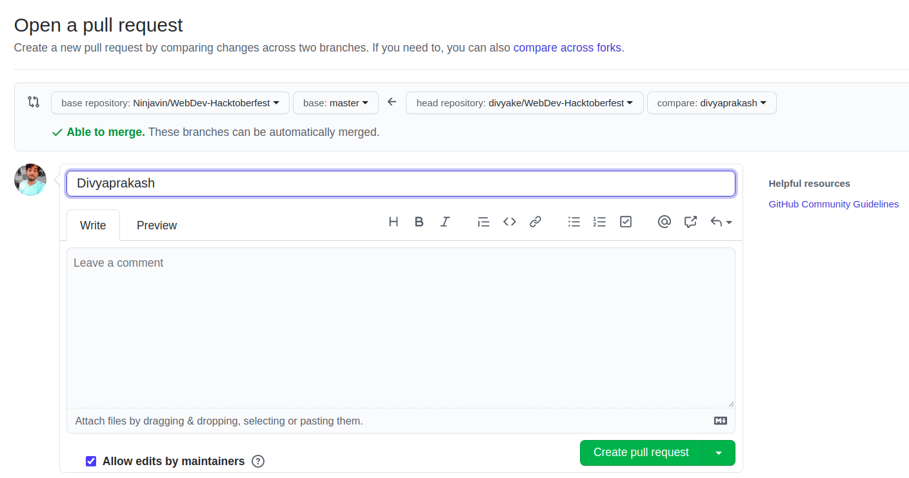

# WebDev-Hacktoberfest
#THIS REPOSITORY IS NOT ELIGIBLE FOR HACKTOBERFEST. PULL REQUESTS MADE HERE WON'T COUNT TOWARDS THE HACKTOBERFEST CHALLENGE!
A repo for complete beginners to get started with contributing in Open Source

## What will you contribute?

https://dsc-iem.github.io/WebDev-Hacktoberfest/

You will modify this card according to your details and add this to the webpage.

## Steps to Follow

### Step 1: Fork this repository

- A fork would place a copy of this project in your GitHub Account

### Step 2: Clone the repository

- Cloning the repository will place a local copy of project on your own machine
- Copy the URL from the copy to clipboard icon

- Open a terminal and run the following git command :
  
`git clone https://github.com/<your-user-name>/WebDev-Hacktoberfest.git`

### Step 3: Create a branch

- A branch is a way to keep your changes separate from the main part of the project called `Master`. For example if things go wrong and you are not happy with your changes you can simply delete the branch and the main project won't be affected.

Change to the repository directory on your computer (if you are not already there):

`cd WebDev-Hacktoberfest`

Now create a branch using the `git checkout` command:

`git checkout -b <your-name-profile-card>`

(While the branch name can be anything we suggest you to keep it the way we mentioned.)

## Step 4: Make necessary changes and commit

Open `index.html`. Make a copy of the card-template and modify it with your details.

Copy the exact portion given in the screenshot and paste it. Maintain a gap of 2-3 lines between the profile cards. Indentation should be kept in mind.

Modify the profile card with your information. If you execute the command `git status`, you'll see there are changes.

Add those changes to the branch you just created using the `git add` command:

`git add .`

Now commit those changes using the `git commit` command:

`git commit -m "<your-name> Profile Card Added"`

## Step 5: Push Changes

Push your changes using the command `git push origin <your-branch-name>`

## Step 6: Make a Pull Request

Go to your repository on GitHub, you'll see a `Compare & pull request` button. Click on it.

Now submit the pull request

Congrats! You have made your first contribution!
